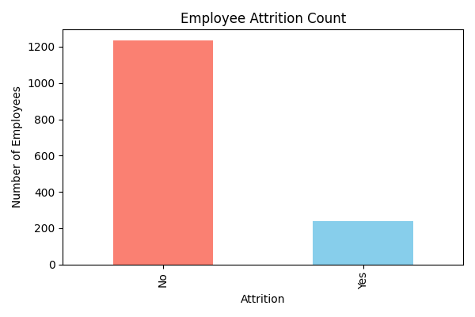
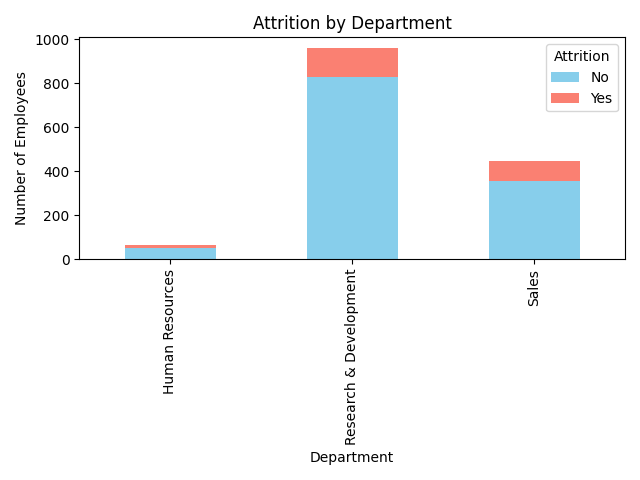
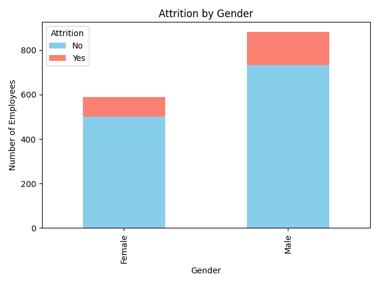
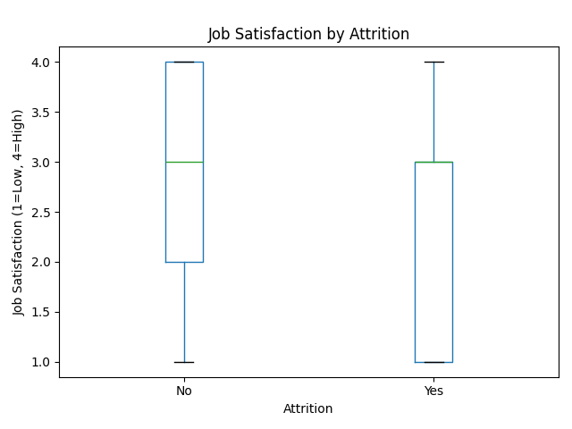
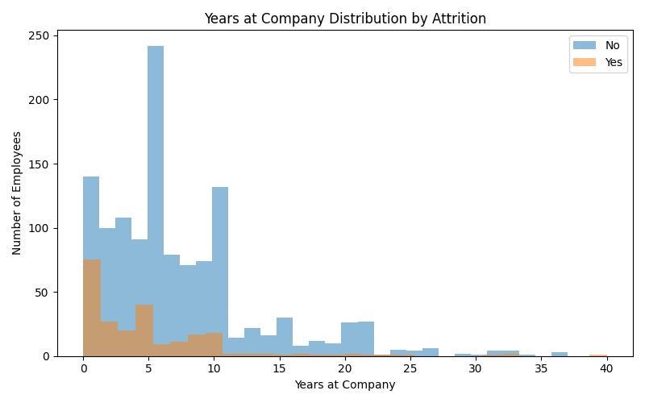
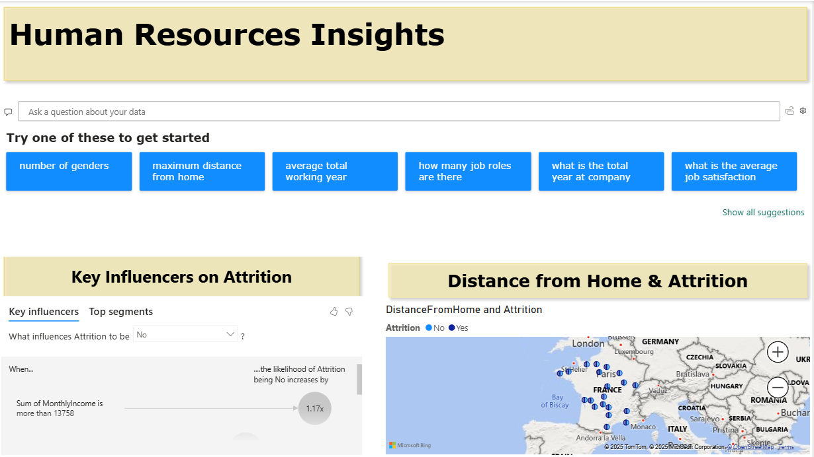

# 

# Human Resources Data Analysis

**Project XYZ** is a comprehensive data analysis tool designed to streamline data exploration, analysis, and visualisation. The tool supports multiple data formats and provides an intuitive interface for both novice and expert data scientists.

## Dataset Content
The HR Employee Attrition dataset contains 1,470 employee records and 35 variables, covering demographic details, job-related information, compensation, work conditions, satisfaction scores, and performance ratings. Demographic features include age, gender, and marital status, while job-related data captures department, job role, job level, years at the company, and time in the current role or under the current manager. Compensation is represented through monthly income, hourly and daily rates, monthly rate, stock option level, and recent salary hikes. Work conditions include business travel frequency, distance from home, overtime status, work-life balance, and training participation. Satisfaction metrics assess environment, job, and relationships, while performance ratings capture employee evaluation scores. The target variable, Attrition, indicates whether an employee has left the company. Some variables, such as EmployeeCount, Over18, and StandardHours, are constants and can be removed for analysis. The dataset is complete with no missing values, making it suitable for predictive modeling and exploratory analysis to understand factors influencing employee turnover.

## Business Requirements
## User Stories
As an HR manager, I want to see which employees are at risk of leaving, so that I can take action to retain them.
As a company executive, I want to understand the main factors driving employee attrition, so that I can make informed policy decisions.
As a team lead, I want to monitor attrition trends by department over time, so that I can identify and address problem areas early.

* Describe your business requirements #need to add

## 1. Employee Attrition Count

This plot shows the number of employees who left (Attrition=Yes) versus those who stayed. A high attrition count may indicate retention issues that require immediate attention.

---

## 2. Attrition by Department

This plot highlights which departments have the highest attrition rates. Departments with more leavers should be prioritized for targeted retention strategies.

---

## 3. Attrition by Gender

This plot reveals if attrition is higher for a particular gender. Addressing any gender-specific retention issues can help promote diversity and inclusion.

## 4. Monthly Income Distribution by Attrition

This plot compares the income distribution of employees who left versus those who stayed. Lower income levels may correlate with higher attrition, suggesting a need to review compensation policies.

## 5. Job Satisfaction by Attrition

This boxplot shows whether employees who left had lower job satisfaction. Improving job satisfaction could be an effective way to reduce attrition.

## 6. Years at Company Distribution by Attrition

This plot illustrates how long employees who left versus stayed had been at the company. High early attrition may indicate onboarding or engagement issues that need to be addressed.

## Hypothesis and how to validate?

1. **Attrition vs. Department**  
   - **Hypothesis:** Employee attrition rates are the same across all departments.  
   - **Test:** Chi-square test of independence.

2. **Attrition vs. Gender**  
   - **Hypothesis:** Attrition rates do not differ between male and female employees.  
   - **Test:** Chi-square test of independence.

3. **Attrition vs. Monthly Income**  
   - **Hypothesis:** Employees who leave have the same average monthly income as those who stay.  
   - **Test:** Independent samples t-test.

4. **Attrition vs. Job Satisfaction**  
   - **Hypothesis:** Job satisfaction scores are the same for employees who leave and those who stay.  
   - **Test:** Mann-Whitney U test (for ordinal data) or t-test (for continuous data).

5. **Attrition vs. Years at Company**  
   - **Hypothesis:** The average years at the company is the same for employees who leave and those who stay.  
   - **Test:** Independent samples t-test.

## Project Plan
The analysis followed a structured, high-level workflow to ensure accuracy, efficiency, and reproducibility. The main steps were:
1.	Data Collection – The dataset was sourced from the HR Employee Attrition records, containing 1,470 entries and 35 variables covering demographics, job information, compensation, work conditions, satisfaction, and attrition status.
2.	Data Loading & Management – The raw CSV file was loaded into Python using the Pandas library. During the loading phase, column names, data types, and completeness were verified. The dataset was stored in a version-controlled environment to maintain integrity throughout the analysis.
3.	Data Cleaning & Preprocessing – Redundant constant columns (EmployeeCount, Over18, StandardHours) were removed. Categorical features were prepared for encoding, and numerical features were reviewed for scaling if required. No missing values were found, so imputation was not necessary.
4.	Exploratory Data Analysis (EDA) – Summary statistics and visualizations were generated to understand distributions, detect outliers, and reveal patterns in the data. Special focus was given to the relationship between attrition and factors such as overtime, job role, years at the company, and income.
5.	Modeling & Analysis – Machine learning models (e.g., Random Forest Classifier) were chosen to identify key drivers of attrition and predict employee turnover. The data was split into training and testing sets to evaluate performance objectively.
6.	Interpretation & Insights – Model results were interpreted alongside visual analysis to identify actionable insights for HR strategy, including which factors most strongly influenced employee retention.
7.	Documentation & Reporting – All code, outputs, and interpretations were documented in a structured format to ensure reproducibility and clear communication of findings.
Methodology Justification:
This methodology was chosen to balance descriptive analysis (for understanding patterns and relationships) with predictive modeling (for identifying key attrition drivers and estimating turnover risk). Using Python’s data science stack (Pandas, Seaborn, Matplotlib, and scikit-learn) ensured a reproducible, flexible, and well-supported analytical process. EDA was prioritized to guide feature selection, while supervised machine learning provided quantifiable importance metrics for decision-making.

## The rationale to map the business requirements to the Data Visualisations
* List your business requirements and a rationale to map them to the Data Visualisations

## Analysis Techniques Used  

### Methods Applied  
- **Exploratory Data Analysis (EDA):** Investigated variable distributions, outliers, and subgroup patterns using descriptive statistics and visualisations (histograms, boxplots, bar charts, heatmaps).  
- **Correlation and Association Testing:**  
  - Numeric ↔ Numeric: Pearson and Spearman correlation coefficients.  
  - Binary target (**Attrition**) ↔ Numeric: Point-biserial correlation and non-parametric tests (Mann–Whitney U) when normality was not met.  
  - Categorical ↔ **Attrition**: Chi-square tests and Cramér’s V for strength of association.  
- **Target-based Aggregation:** Grouped data by `Attrition` to compare means and proportions (e.g., attrition rates by **OverTime** status).  
- **Feature Transformation:** One-hot encoding for categorical variables and consolidation of rare levels to improve interpretability.  

**Limitations & Alternative Approaches:**  
- Target imbalance (far more “No” than “Yes” in `Attrition`) reduced the statistical power of certain tests.  
  - **Alternative:** class balancing (e.g., SMOTE) for predictive modelling.  
- High cardinality in features like `JobRole` diluted insights.  
  - **Alternative:** logical grouping of similar categories or Weight of Evidence (WoE) encoding (with caution to prevent leakage).  
- Potential multicollinearity between variables (e.g., `JobLevel` and `MonthlyIncome`).  
  - **Alternative:** remove redundant features after Variance Inflation Factor (VIF) analysis.  

---

## Structuring the Analysis Techniques  

1. **Data Loading & Cleaning** – Ensured correct data types, standardised category labels (e.g., `Travel_Rarely`), and checked for duplicates or missing values.  
2. **Initial EDA** – Explored overall distributions and potential outliers to guide hypothesis formulation.  
3. **Hypothesis Testing** – Applied statistical tests (Chi-square, point-biserial, Mann–Whitney) to confirm or reject initial assumptions.  
4. **Subgroup Analysis** – Used `groupby` summaries and visualisations to compare attrition rates across departments, roles, and other key features.  
5. **(Optional) Feature Preparation for Modelling** – Encoded categorical variables and considered balancing methods for predictive modelling.  

**Justification:**  
This sequence moves from data understanding → hypothesis generation → statistical validation → in-depth subgroup comparisons. It ensures each step builds logically on the last, avoiding data leakage and making the process reproducible.  

---

## Data Limitations and Workarounds  

- **Single Snapshot Data:** The dataset lacks a time-series component, limiting trend analysis.  
  - **Workaround:** focused on cross-sectional patterns and scenario simulations.  
- **Imbalanced Target Variable:** Majority “No” in `Attrition` could obscure smaller effects.  
  - **Workaround:** stratified visualisations and weighted insights; for models, applied balancing strategies like SMOTE.  
- **Operational Noise:** Certain fields (e.g., `DailyRate`, `MonthlyRate`) added little interpretive value.  
  - **Workaround:** concentrated on more explanatory variables such as `OverTime`, `JobSatisfaction`, `YearsAtCompany`, and `DistanceFromHome`.  
- **High Cardinality in Categorical Features:**  
  - **Workaround:** consolidated similar categories (e.g., merging niche job roles) and used normalised proportions for visual clarity.  

---

## Use of Generative AI for Ideation, Design Thinking, and Code Optimisation  

- **Ideation:** Generated hypothesis ideas and feature combinations likely to influence attrition (e.g., “OverTime + low JobSatisfaction + short YearsAtCompany” as a high-risk profile). Suggested relevant visualisation types, such as stacked bar charts for attrition by **OverTime** and **JobLevel**.  
- **Design Thinking & Storytelling:** Helped structure the narrative from “what” (findings) → “why” (underlying drivers) → “so what” (actionable recommendations) for both technical and non-technical audiences.  
- **Code Optimisation:** Improved Pandas workflows by replacing slow `.apply()` loops with vectorised operations, streamlining `groupby.agg` pipelines, and creating reusable plotting functions for consistent visuals.  
- **Documentation:** Assisted in drafting clear, concise README sections and presentation text, ensuring both technical accuracy and accessibility.  

## Ethical considerations
* Were there any data privacy, bias or fairness issues with the data?
* How did you overcome any legal or societal issues?

## Dashboard Design

The Power BI dashboard was designed using the Balsamiq software. The main dashboard page has been designed in the following way:

* List all dashboard pages and their content, either blocks of information or widgets, like buttons, checkboxes, images, or any other item that your dashboard library supports.
The Power BI dashboard has the following pages:

* Business requirement 1

* Business requirement 2

* Business requirement 3

* Dashboard

The main dashboard has the has the following features:

* AI driven Q & A 

* Key Influencers

* Map 

* Later, during the project development, you may revisit your dashboard plan to update a given feature (for example, at the beginning of the project you were confident you would use a given plot to display an insight but subsequently you used another plot type).
* How were data insights communicated to technical and non-technical audiences?
* Explain how the dashboard was designed to communicate complex data insights to different audiences. 

## Unfixed Bugs
* Please mention unfixed bugs and why they were not fixed. This section should include shortcomings of the frameworks or technologies used. Although time can be a significant variable to consider, paucity of time and difficulty understanding implementation are not valid reasons to leave bugs unfixed.
* Did you recognise gaps in your knowledge, and how did you address them?
* If applicable, include evidence of feedback received (from peers or instructors) and how it improved your approach or understanding.

## Development Roadmap
* What challenges did you face, and what strategies were used to overcome these challenges?
* What new skills or tools do you plan to learn next based on your project experience? 

## Deployment

We are using Power BI in order to make the Dashboards.

6. If the slug size is too large then add large files not required for the app to the .slugignore file.

## Main Data Analysis Libraries
* Here you should list the libraries you used in the project and provide an example(s) of how you used these libraries.

## Credits 

* In this section, you need to reference where you got your content, media and extra help from. It is common practice to use code from other repositories and tutorials, however, it is important to be very specific about these sources to avoid plagiarism. 
* You can break the credits section up into Content and Media, depending on what you have included in your project. 

### Content 

- The text for the Home page was taken from Wikipedia Article A
- Instructions on how to implement form validation on the Sign-Up page was taken from [Specific YouTube Tutorial](https://www.youtube.com/)
- The icons in the footer were taken from [Font Awesome](https://fontawesome.com/)

### Media

- The photos used on the home and sign-up page are from This Open-Source site
- The images used for the gallery page were taken from this other open-source site

## Acknowledgements (optional)
* Thank the people who provided support through this project.
